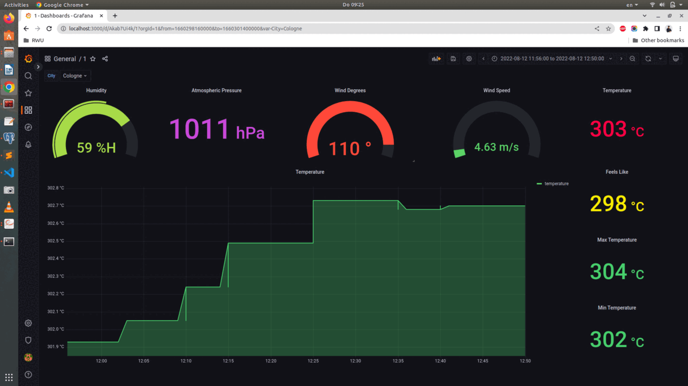

# Real-Time-Data-Analysis
This project builds data analysis pipeline for storing the real time streaming data using Bigdata technologies and to create a dashboard using Grafana for visualization.

# Prerequisites

* [Sign up](https://home.openweathermap.org/) and get an Open Weather API Key
* Depending on the os install [Docker](https://docs.docker.com/engine/install/)
* For Visualization install [Grafana](https://grafana.com/docs/grafana/latest/setup-grafana/installation/)

# Architecture

# Grafana Dashboard

