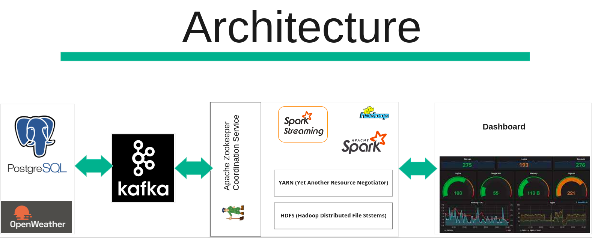

# Real-Time-Data-Analysis
This project builds data analysis pipeline for storing the real time streaming data using Bigdata technologies and to create a dashboard using Grafana for visualization.

# Prerequisites

* [Sign up](https://home.openweathermap.org/) and get an Open Weather API Key
* Depending on the os install [Docker](https://docs.docker.com/engine/install/)
* For Visualization install [Grafana](https://grafana.com/docs/grafana/latest/setup-grafana/installation/)

# Architecture


Spark and Kafka Installation

!!! Note
```bash
pip install pyspark
```
```bash
pip install kafka-python
```

Dependency files can be downloaded from below links

!!! Note

> https://mvnrepository.com/artifact/org.apache.spark/spark-sql-kafka-0-10_2.12/3.0.1
> https://mvnrepository.com/artifact/org.apache.kafka/kafka-clients/2.6.0
> https://mvnrepository.com/artifact/org.apache.spark/spark-streaming-kafka-0-10-assembly_2.12/3.0.1
> https://mvnrepository.com/artifact/org.postgresql/postgresql/42.2.16
> https://mvnrepository.com/artifact/org.apache.commons/commons-pool2/2.8.1


## Docker file to run zookeeper and kafka 
```bash
docker-compose up -d
```

## Run to publish the open weather data to kafka topic
```bash
python weather_live_data.py
```

## Run to subscribe the data and store it using pyspark in Postgresql and HDFS
```bash
python process_data_spark.py
```

# Grafana Dashboard


